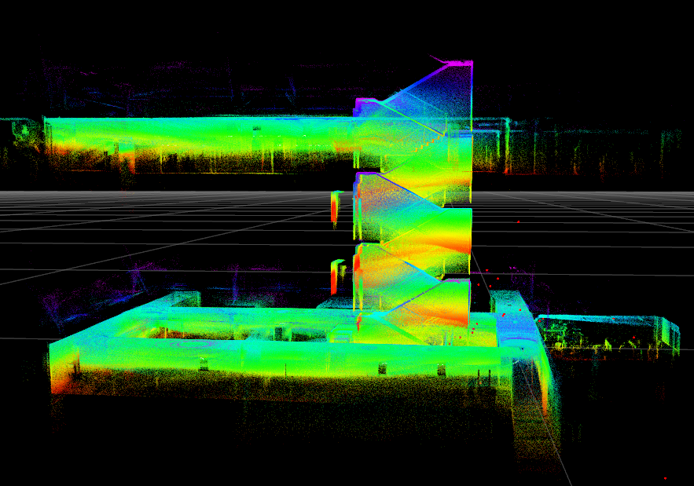
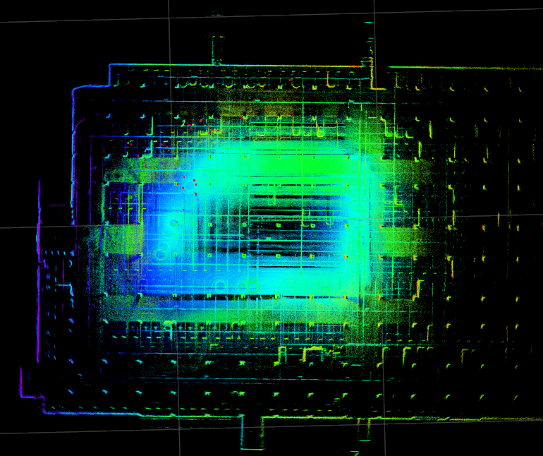

# (CVLAB) R2LIVE-STEREO 
## 0. Introduction

**Developer** : <br><br>
Computer Vision Lab @ HYU
- Minbum Joo (wnalsqja@gmail.com)

**Previous Work**: 
- R2LIVE - https://github.com/hku-mars/r2live 
- VINS_FUSION - https://github.com/HKUST-Aerial-Robotics/VINS-Fusion
 
**R2LIVE** is a robust, real-time tightly-coupled multi-sensor fusion framework, which fuses the measurement from the LiDAR, inertial sensor, visual camera to achieve robust, accurate state estimation. Taking advantage of measurement from all individual sensors, our algorithm is robust enough to various visual failure, LiDAR-degenerated scenarios, and is able to run in real time on an on-board computation platform, as shown by extensive experiments conducted in indoor, outdoor, and mixed environment of different scale.

**R2LIVE-STEREO** is a change from the existing subsystem MONOVIO pipeline to STEREO VIO. 


## 1. Prerequisites
### 1.1 **Ubuntu** and **ROS**
Our task is tested at Ubuntu 18.04, ROS Melodic [ROS Installation](http://wiki.ros.org/ROS/Installation) 

### 1.2. **Ceres Solver**

Follow [Ceres Installation](http://ceres-solver.org/installation.html).

### 1.3. **livox_ros_driver2** <br>
To use our sensor setup, MID360 LiDAR, you need to install.<br>
Follow [livox_ros_driver Installation](https://github.com/Livox-SDK/livox_ros_driver2).

## 2. Build r2live-STEREO on ROS:
Clone the repository and catkin_make:

```
    cd ~/catkin_ws/src
    git clone -
    cd ../
    catkin_make
    source ~/catkin_ws/devel/setup.bash
```

## 4. Run our examples
```
roslaunch r2live cvlab_0530.launch
rosbag play DOWNLOADED_FILE.bag
```

The result of [3stair_long.bag](To do :: upload link) :
<div align="center">
    
</div>

and [parking_1st.bag](To do :: upload link) :
<div align="center">
    
</div>
